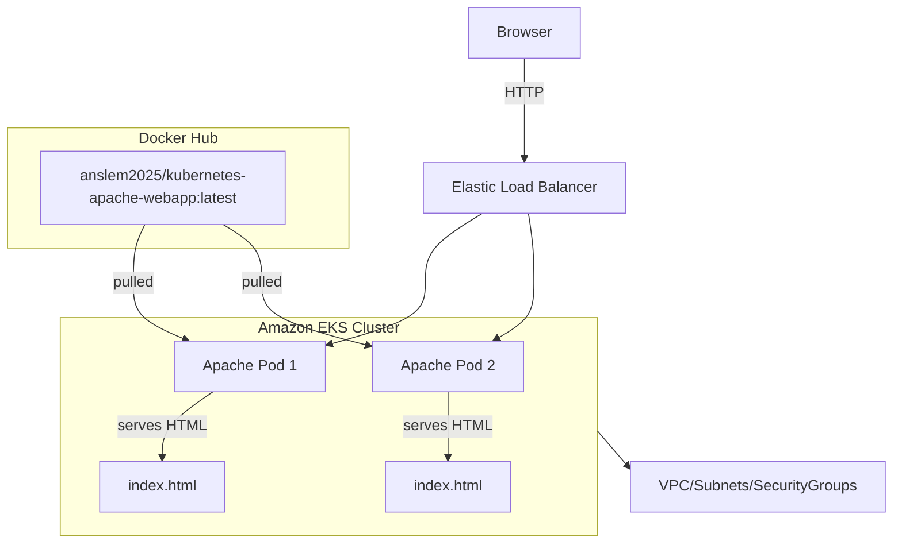

🚀 Kubernetes Apache WebApp on AWS EKS
🧠 Introduction

This project demonstrates how to containerize and deploy a web application using Docker, Kubernetes, and Amazon EKS (Elastic Kubernetes Service).
The goal was to create a highly available, scalable, and cloud-native infrastructure to host an Apache web application, showcasing how DevOps practices streamline deployment using Infrastructure as Code (IaC) and container orchestration.

The process involves:

Containerizing the Apache application with Docker.

Pushing the image to Docker Hub for accessibility.

Provisioning an EKS cluster using eksctl.

Deploying the web application using Kubernetes manifests (Deployment and Service).

Exposing the application via an AWS LoadBalancer to make it accessible to the public.


🧰 Tools Used

AWS CLI – for AWS configuration and authentication

eksctl – to provision and manage the EKS cluster

kubectl – to deploy and manage Kubernetes resources

Docker Hub – to store and pull the application image

⚙️ Steps to Reproduce
## 1) Install and Configure AWS CLI
## 2) install eksctl
```bash
curl -sLO "https://github.com/eksctl-io/eksctl/releases/latest/download/eksctl_$(uname -s)_amd64.tar.gz"
tar -xzf eksctl_$(uname -s)_amd64.tar.gz
sudo mv eksctl /usr/local/bin
eksctl version
```

## 3) Create an EKS Cluster
```bash
eksctl create cluster \
--name playground-cluster \
--region us-west-2 \
--nodes 3 \
--node-type t3.medium \
--managed
```
This creates:

An EKS control plane

3 worker nodes (EC2 instances)

Networking and IAM roles automatically

wait 5-10mins 


## 4) Connect kubectl to EKS

Once the cluster is ready, configure kubectl to communicate with it:

```bash
aws eks --region us-west-2 update-kubeconfig --name playground-cluster
```
- Test the connection:

```bash
kubectl get nodes
```


## 5) Create Your Kubernetes Deployment File


- Apply it
 ```bash
  kubectl apply -f deployment.yaml
 ```
- Verify
```bash
  kubectl get deployments
kubectl get pods
```


## 6) Expose the Deployment with a LoadBalancer
- Create a service.yaml file:


 - Apply it
   ```bash
   kubectl apply -f service.yaml
   ```
 - Verif
   ```bash
   kubectl get services
   ```


- You’ll see an EXTERNAL-IP or DNS  — copy that and open it in your browser:

 

 ## Troubleshooting and Useful kubectl Commands
 
 ```bash
kubectl describe pod
```


- kubectl describe service
  

  ##  Clean Up Resources
  ```bash
  eksctl delete cluster --name playground-cluster --region us-west-2
  ```
🧾 Conclusion

This project successfully demonstrates a complete containerized deployment workflow — from Docker image creation to Kubernetes orchestration on AWS.
By leveraging EKS, Docker, and Kubernetes, we achieved:

Automated deployment

High availability

Load-balanced access

Full cloud-native scalability

This end-to-end implementation reflects real-world DevOps practices, combining containerization, orchestration, and cloud infrastructure management.
